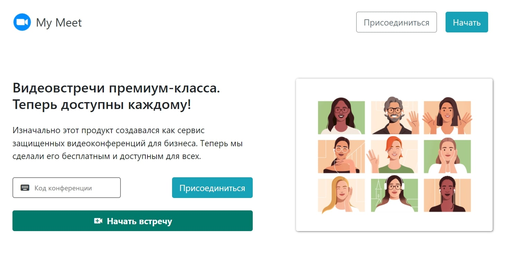

# 💻 Video Chat App 🎬




## Project Information

An application for convenient user interaction by the use of video and audio streaming in real time.\
This app provide you:

- Create rooms by uniq id or join the meeting by id;
- Use your own computer camera and audio system to communicate with other members;
- Mute your audio and video;
- Send messages by using a private chat connected into current room;

## Demo

🌐 https://morning-everglades-75841.herokuapp.com

### Technologies Used

| Technology | Description                                                                                                                                                                                                                                                     | Link 🌐                  |
| ---------- | --------------------------------------------------------------------------------------------------------------------------------------------------------------------------------------------------------------------------------------------------------------- | ------------------------ |
| JavaScript | High Level, Dynamic, Interpreted Language                                                                                                                                                                                                                       | ----                     |
| NodeJS     | Node.js is a JavaScript runtime built on Chrome's V8 JavaScript engine.                                                                                                                                                                                         | https://nodejs.org/en    |
| Socket.IO  | Bidirectional and low-latency communication for every platform                                                                                                                                                                                                  | https://socket.io        |
| ExpressJS  | Fast, unopinionated, minimalist web framework for Node.js.                                                                                                                                                                                                      | https://expressjs.com    |
| PeerJS     | PeerJS simplifies WebRTC peer-to-peer data, video, and audio calls.                                                                                                                                                                                             | https://peerjs.com       |
| Heroku     | Heroku is a cloud platform that lets companies build, deliver, monitor and scale apps — we're the fastest way to go from idea to URL, bypassing all those infrastructure headaches.                                                                             | https://www.heroku.com   |
| Bootstrap  | Quickly design and customize responsive mobile-first sites with Bootstrap, the world’s most popular front-end open source toolkit, featuring Sass variables and mixins, responsive grid system, extensive prebuilt components, and powerful JavaScript plugins. | https://getbootstrap.com |

## Project setup

```
npm install
heroku create
heroku git:clone -a morning-everglades-75841

```

### Compiles and hot-reloads for development

```
npm run start
```

### Compiles and minifies for production

```
git push heroku main
```
